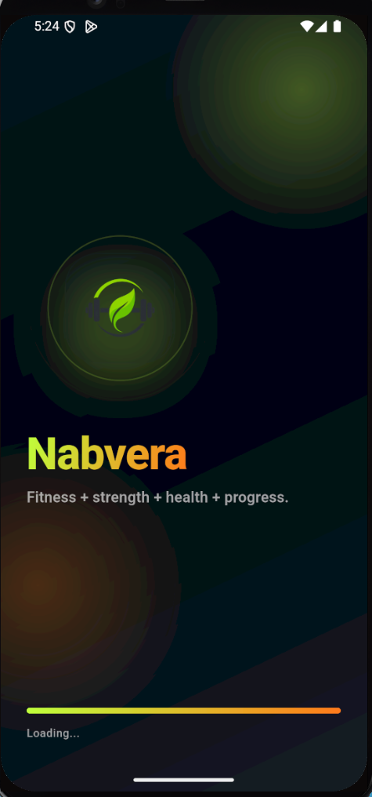
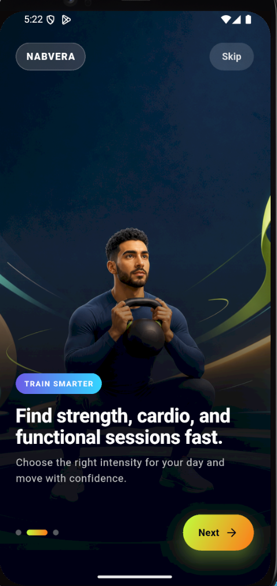
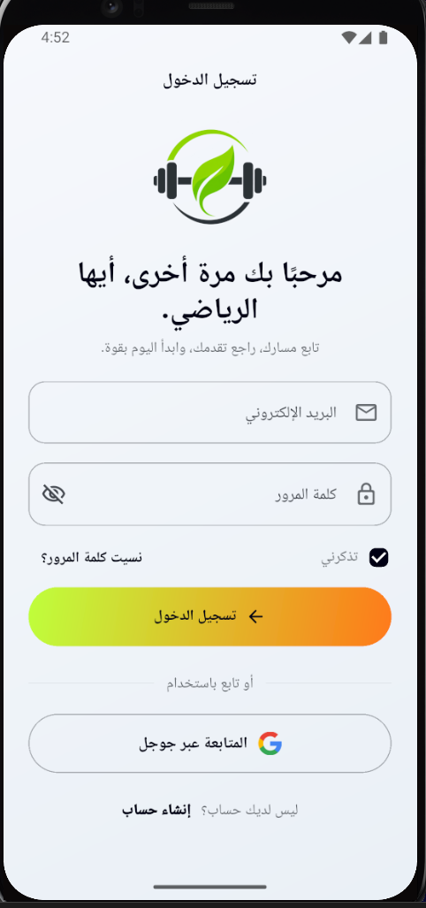
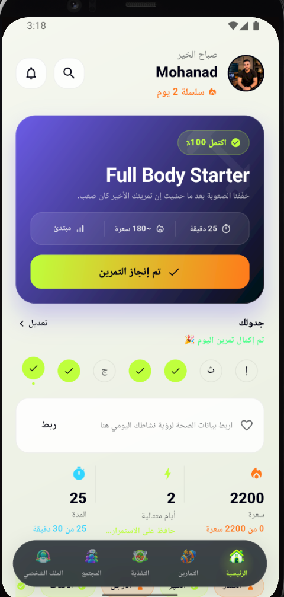
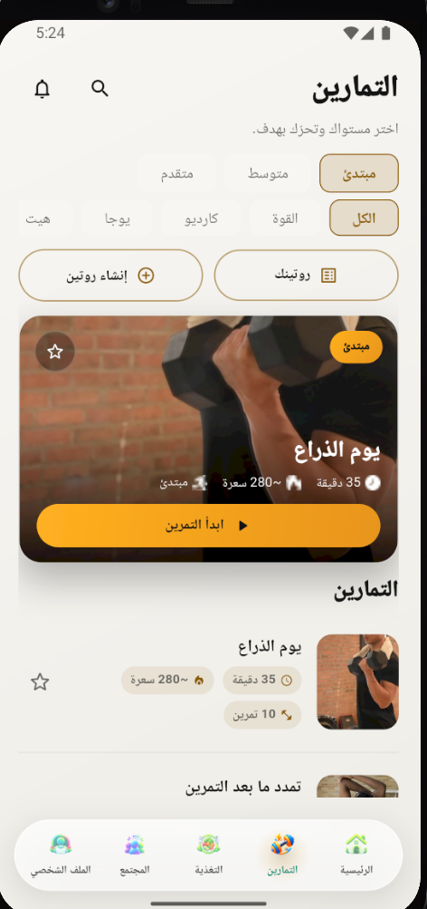
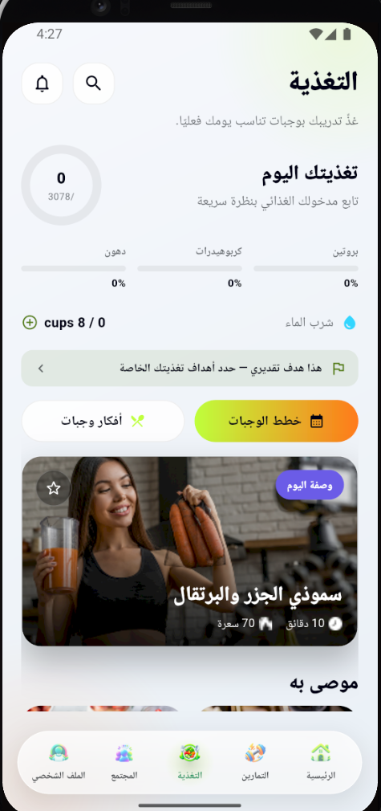
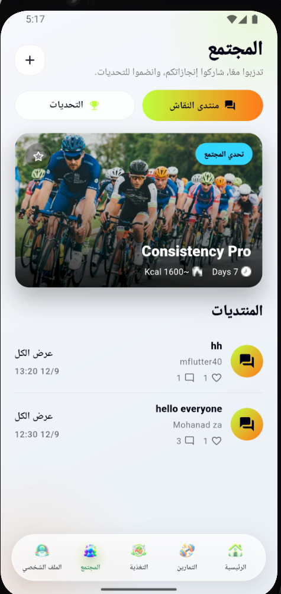
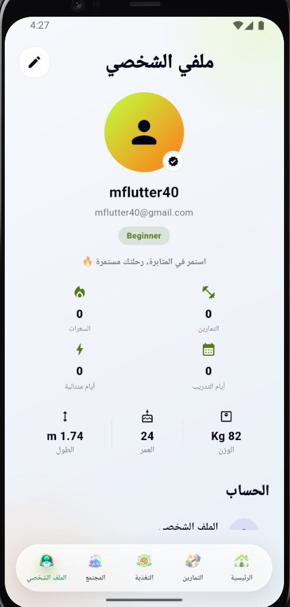

# Nabvera - Premium Workout & Health Platform

A full-stack fitness application — Flutter client + a real Node.js/Express/MongoDB backend — that helps users manage workouts, build a consistent training habit, and stay motivated through real progress tracking, challenges, and local reminders. Wrapped in a premium, glassmorphic dark/light design system inspired by apps like Apple Fitness+ and Nike Training Club.

<p align="left">
  
  
  
  
  
  
</p>

---

## 📱 Project Preview

<p align="center">
  
  
  
  
  
</p>
<p align="center">
  
  
  
</p>

---

## 🆕 What's New

The app has grown well past its original mock-data prototype into a real, backend-driven product:

- **Real backend** — Node.js/Express/MongoDB API (deployed on Render), Firebase Authentication (email/password + Google Sign-In), and Firebase Cloud Messaging push notifications. No more mock providers — every screen reads and writes real data.
- **Rule-based workout recommendations** — a "today's plan" hero card driven by the user's goal, activity level, available equipment/time, recent difficulty ratings, and a muscle-group recovery map — all computed server-side, no AI involved.
- **Challenges with real progress tracking** — join a challenge (workouts completed, active minutes, workout streak, or weekly consistency) and watch it advance automatically as you log workouts; rule-based suggestions surface the 1–2 challenges that best fit your level, each with a plain-language reason.
- **Workout schedule & smart local reminders** — pick your training days and a reminder time on Edit Profile or straight from Home's schedule card; a single local notification fires per day, skipping days you've already trained and respecting a configurable quiet-hours window — fully on-device (`flutter_local_notifications`), no server push involved.
- **Real notifications inbox** — workout-completed, streak milestones, challenge joined/completed/ending-soon, all categorized and filterable.
- **Bilingual content** — English/Arabic throughout, including admin-authored Home articles, with full RTL layout support.
- **Internal, privacy-respecting analytics** — an allowlisted event/property model on both client and server; nothing is sent when the user opts out from Manage Data.
- **Admin console** — a role-gated dashboard to manage workouts, exercises, recipes, articles, and challenges without touching the database directly.

All of it still sits on the same premium glassmorphic design system, dark/light theme, and clean feature-based architecture the app started with.

---

## ✨ Features

### 🔐 Authentication
- Firebase email/password + Google Sign-In
- Forgot password → reset password flow
- Optional biometric (fingerprint) unlock
- Onboarding & guided setup that feeds the recommendation engine (goal, activity level, equipment, available time)

### 🏋️ Workout
- Browse workouts by category, level, and muscle group
- Rule-based "today's plan" hero card with a recovery-aware alternative and an "easier workout" fallback
- Detailed exercise screens (muscle group, difficulty, duration, equipment)
- Create fully custom routines (name, goal, difficulty, weekly schedule)
- Real workout logs with actual-duration tracking and post-workout difficulty rating
- **Workout schedule** — pick training days + a reminder time; the app schedules smart local reminders that skip already-trained days and respect quiet hours

### 🏆 Community & Challenges
- Discussion forum feed with likes and comments
- Join a challenge and track real progress (workouts, minutes, streak, or weekly consistency) computed entirely on the backend
- Rule-based suggestions ("suggested for you") with a plain-language reason for each
- Retention badges (First Challenge, Consistency Builder, Weekly Winner) — no points store, no leaderboard

### 🥗 Nutrition
- Daily nutrition summary: calorie ring, protein/carbs/fat progress, water intake
- Recipe cards with macros, difficulty, and rating at a glance
- Full recipe details: nutrition facts, ingredients, cooking steps, chef's tips, health benefits, similar recipes
- Guided meal-plan wizard: dietary preferences → goals → generating → daily plan
- Bilingual "Articles & Tips" (English/Arabic, admin-authored)

### 🔔 Notifications
- Real, event-driven in-app inbox: workout completed, streak milestones, challenge joined/completed/ending-soon
- Push delivery via Firebase Cloud Messaging
- Smart local workout reminders (on-device only, no server push)

### 📊 Progress & Fitness
- Weekly progress chart with week-over-week comparison and longest streak
- Calorie & duration estimates from real logs
- Personal workout statistics (workouts completed, streak, training days)
- Muscle-group recovery map (trained-recently vs. ready — no medical claims)

### 🛠️ Admin Console
- Role-gated dashboard (workouts, exercises, recipes, articles, challenges)
- Create/delete content without touching the database

### 🎨 User Experience
- Full Dark Mode & Light Mode support
- Fully responsive layout (phones, foldables, tablets)
- Smooth entrance/press/page animations
- Premium glassmorphism UI with neon accent gradients
- Complete English 🇺🇸 / Arabic 🇸🇦 localization, including RTL support

---

## 🛠️ Technologies Used

**Framework**
- [Flutter](https://flutter.dev) — cross-platform UI toolkit
- [Dart](https://dart.dev) `^3.7.0`

**Backend & Data**
- [Node.js](https://nodejs.org) / [Express](https://expressjs.com) / [MongoDB](https://www.mongodb.com) (Mongoose) — see the companion backend repository
- [firebase_auth](https://pub.dev/packages/firebase_auth) + [google_sign_in](https://pub.dev/packages/google_sign_in) — authentication
- [firebase_messaging](https://pub.dev/packages/firebase_messaging) — push notifications
- [flutter_local_notifications](https://pub.dev/packages/flutter_local_notifications) + [timezone](https://pub.dev/packages/timezone) + [flutter_timezone](https://pub.dev/packages/flutter_timezone) — on-device workout reminders, DST/timezone-aware
- [http](https://pub.dev/packages/http) — REST client

**State Management**
- [flutter_riverpod](https://pub.dev/packages/flutter_riverpod) + [riverpod_generator](https://pub.dev/packages/riverpod_generator) — type-safe, code-generated providers

**Architecture**
- Clean, feature-based architecture (domain / data / presentation)
- Separation of concerns per feature module

**Routing**
- [go_router](https://pub.dev/packages/go_router) — declarative, type-safe navigation with nested shell routes, including a role-gated admin route guard

**Localization**
- `flutter_localizations` + `intl` — generated ARB-based translations (English / Arabic)

**Persistence**
- [shared_preferences](https://pub.dev/packages/shared_preferences) — theme, locale & privacy-preference persistence

**UI & Responsiveness**
- Custom design-token system (`AppColors`, `AppSpacing`, `AppRadius`, `AppTypography`, `AppThemeExtension`)
- Custom breakpoint-based responsive helpers (`AppBreakpoints`, `responsiveValue`) built on `LayoutBuilder` / `MediaQuery`
- `flutter_screenutil` available for screen-size initialization

**Tooling & Testing**
- `build_runner`, `flutter_lints` for code generation & static analysis
- `flutter_test` — unit tests for pure domain logic (scheduling, badges, model parsing) across the app

---

## 🏗️ Architecture

```
lib/
├── core/
│   ├── analytics/         # Allowlisted internal analytics
│   ├── notifications/     # Push registration + local workout-reminder scheduler
│   ├── localization/      # ARB files + generated l10n
│   ├── network/           # API client, base URL resolution
│   ├── routing/           # go_router configuration & routes, admin guard
│   ├── storage/           # Local persistence (shared_preferences)
│   ├── theme/             # Colors, typography, spacing, light/dark themes
│   └── widgets/           # Shared, reusable UI components
│
├── features/
│   ├── authentication/    # Firebase login, register, forgot/reset password, biometric
│   ├── onboarding/        # First-run onboarding flow
│   ├── home/              # Home dashboard, workout schedule card
│   ├── workout/           # Workouts, routines, exercise details, logs
│   ├── nutrition/         # Nutrition & meal planning, articles
│   ├── community/         # Forum + challenges (progress, suggestions, badges)
│   ├── notification/      # In-app notifications inbox
│   ├── profile/           # Profile, workout schedule, settings, privacy, help
│   ├── admin/             # Role-gated admin console
│   ├── favorite/          # Saved workouts & meals
│   └── search/            # Global search
│
└── main.dart
```

Each feature module is self-contained and typically follows:

```
feature/
├── domain/          # Plain, pure models & business logic (unit-tested)
├── data/            # Repository classes talking to the backend
└── presentation/
    ├── pages/       # Screens
    ├── providers/   # Riverpod controllers/state
    └── widgets/     # Feature-specific reusable widgets
```

**Why this structure?**
- **Separation of concerns** — UI, state, and data never leak into each other.
- **Scalability** — new features are added as new self-contained folders without touching existing ones.
- **Maintainability** — shared visual language lives once in `core/`, so every screen stays consistent by construction.
- **Testability** — business logic (scheduling, streaks, badges, suggestions) lives in pure `domain/` functions with no plugin/network dependency, so it's directly unit-tested.

---

## 📲 Screens

| Screen | Description |
|---|---|
| Splash | Fully vector, animated brand launch screen |
| Welcome & Onboarding | Abstract hero-art carousel + guided setup (goal, level, equipment, time) |
| Authentication | Firebase login, register, forgot/reset password, biometric enable |
| Home Dashboard | Today's rule-based plan, workout schedule card, recovery map, weekly progress |
| Workout | Browse workouts, category filters, training-of-the-day |
| Create/Your Routine | Build and browse fully custom routines |
| Workout / Exercise Details | Muscle group, difficulty, duration, equipment, start CTA |
| Nutrition | Daily summary, meal ideas, recipe details, meal-plan wizard, bilingual articles |
| Community | Discussion forum |
| Challenges | Suggested, active, and completed challenges with real progress and badges |
| Notifications | Categorized, filterable notification inbox |
| Profile | Stats, workout schedule editor, achievements, account menu |
| Settings | Theme, language, notifications, password, privacy |
| Admin Console | Manage workouts, exercises, recipes, articles, and challenges |

---

## 🚀 Installation

**1. Clone the repository**

```bash
git clone YOUR_REPOSITORY_URL
cd nabvera
```

**2. Install dependencies**

```bash
flutter pub get
```

**3. Generate code (Riverpod providers & localization)**

```bash
dart run build_runner build --delete-conflicting-outputs
flutter gen-l10n
```

**4. Add Firebase config**

Add your own `android/app/google-services.json` (and `ios/Runner/GoogleService-Info.plist` for iOS) from your Firebase project — see [Environment Setup](#️-environment-setup) below.

**5. Run the application**

```bash
flutter run
```

---

## ⚙️ Environment Setup

**Requirements**
- Flutter SDK `>= 3.7.0`
- Dart SDK `>= 3.7.0` (bundled with Flutter)
- Android Studio or VS Code with the Flutter/Dart plugins
- Xcode (for iOS builds, macOS only)
- A Firebase project with Authentication (Email/Password + Google) enabled
- The companion [Nabvera backend](../backend-nabvera) running locally or deployed

**Configuration steps**
1. Verify your setup with `flutter doctor`.
2. Run `flutter pub get` to fetch dependencies.
3. Add your Firebase config files (`google-services.json` / `GoogleService-Info.plist`) and regenerate `lib/firebase_options.dart` with the FlutterFire CLI if you're pointing at your own Firebase project.
4. Re-run `dart run build_runner build` after modifying any `@riverpod` provider or model.
5. Re-run `flutter gen-l10n` after editing any `.arb` translation file.
6. On Android 13+, local workout reminders require the `POST_NOTIFICATIONS` runtime permission — already requested at the right moment (when the user saves a schedule), no extra setup needed.

---

## 🔌 API Configuration

The app talks to a real backend by default — no mock data. The base URL defaults to the deployed Render instance, so `flutter run` works out of the box.

To point at a different backend (e.g. a local dev server):

```bash
# Android emulator
flutter run --dart-define=API_BASE_URL=http://10.0.2.2:5000/api

# iOS simulator / desktop / web
flutter run --dart-define=API_BASE_URL=http://localhost:5000/api
```

See the backend repository for setting up MongoDB, Firebase Admin credentials, and running the API server itself.

---

## 🎨 Design System

- **Premium dark fitness theme** — deep, near-black backgrounds with a neon lime / electric orange accent gradient
- **Refined light theme** — warm neutral surfaces, soft shadows, and clean elevated cards (not flat pure-white Material defaults)
- **Glassmorphism cards** — translucent/frosted surfaces with soft borders and shadows across both themes
- **Flat, on-page sections** — dashboard sections (schedule, weekly progress, recovery map) sit directly on the background with dividers rather than boxed cards, for a lighter, more editorial feel
- **Vector-first hero art** — splash, onboarding, welcome, and auth screens use generated gradient medallions, dashed orbit rings, and glow orbs instead of stock photography, so the brand look is consistent and license-free
- **Generated avatars** — `UserAvatar` renders a gradient-and-icon avatar from the theme instead of reusing a single stock photo for every user/post
- **Consistent typography scale** — a single `AppTypography` scale shared by every screen
- **Responsive layouts** — breakpoint-aware spacing, grid columns, and component sizing from small phones to tablets
- **Micro-interactions** — press-scale feedback, fade/slide entrance animations, and animated selection states throughout

---

## ⚡ Performance & Best Practices

- Clean, feature-based architecture with clear domain/presentation boundaries
- Centralized, reusable widgets (`PremiumScaffold`, `PrimaryButton`, `FadeSlideIn`, `UserAvatar`, `PremiumRecipeCard`, `WorkoutHeroCard`, etc.) instead of duplicated UI code
- `const` constructors used wherever possible to minimize rebuilds
- `ListView.builder` / `SliverList` / `SliverGrid` for efficient large-list rendering
- Structurally overflow-safe layouts via `CustomScrollView` + slivers instead of fixed-height stacks
- Scoped, granular Riverpod providers to avoid unnecessary widget rebuilds
- Fully responsive UI built on `LayoutBuilder`/`MediaQuery` rather than fixed pixel values
- Pure, dependency-free `domain/` functions for anything business-logic-shaped, so it's unit-testable without a running app

---

## 🔮 Future Improvements

- 🤖 AI-powered workout recommendations (current recommendations are deliberately rule-based, no AI)
- ⌚ Wearable device integration (Apple Watch / Wear OS)
- 📷 Real food logging & calorie tracking from photos
- 🏆 Social leaderboards (challenges are intentionally personal-progress-only today, no rankings)
- 📈 Advanced analytics dashboards for admins
- 🔁 Automatic reminder rescheduling across a device reboot without reopening the app

---

## 👨‍💻 Developer

**Mohanad Zaqout**
Flutter Developer

- GitHub: [github.com/mohanad-2003](https://github.com/mohanad-2003)
- LinkedIn: [linkedin.com/in/mohanad-zaqout](https://linkedin.com/in/mohanad-zaqout-b2462b3a1)
- Portfolio: [your-portfolio.com](https://your-portfolio.com)

---

## 📄 License

This project is licensed under the **MIT License** — see the [LICENSE](LICENSE) file for details.
